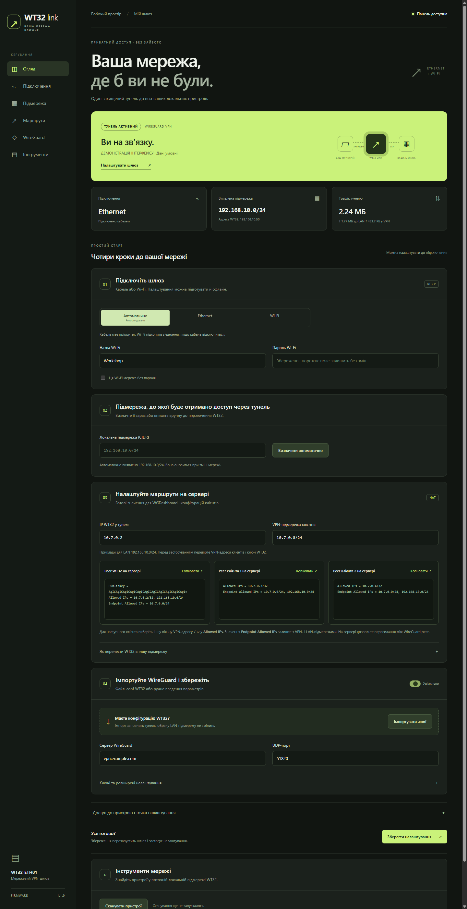

# Wt32-ECH01-VPN-DOR-TO-LAN

<p align="center">
  <strong>Маленький пристрій — безпечний шлях до всієї локальної мережі.</strong><br>
  Україномовна прошивка для WT32-ETH01 · Ethernet / Wi-Fi · WireGuard · IPv4 NAT
</p>

<p align="center">
  <a href="release/wt32-link-factory.bin"></a>
  <a href="release/firmware.bin"></a>
  <a href="tests/HARDWARE.md"></a>
</p>

> [!IMPORTANT]
> Фізична плата — **WT32-ETH01** з ESP32, LAN8720 і флешпам’яттю 4 МБ. Назва репозиторію `Wt32-ECH01-VPN-DOR-TO-LAN` збережена за назвою проєкту. Звичайна ESP32 без Ethernet-чипа цією версією не підтримується; [універсальний образ заплановано](NEXT-VERSION-CHANGES.md).



**Що це дає.** WT32 підключається кабелем або до Wi-Fi тієї мережі, куди треба потрапити ззовні. Пристрій встановлює власний WireGuard-тунель до вашого сервера та передає трафік від інших VPN-клієнтів до локальної підмережі. Камери, NAS, контролери й вебпанелі залишаються зі своїми звичайними адресами; встановлювати на них VPN-клієнт не потрібно.

**Коли корисно:** доступ до домашньої чи офісної мережі під час подорожі; обслуговування техніки на віддаленому об’єкті; доступ до пристроїв, які не вміють WireGuard; мережі без публічної IP-адреси, якщо WT32 може виходити на ваш VPN-сервер. Сервер і віддалені клієнти мають дозволяти маршрут до LAN через peer WT32.

| Параметр | Значення |
| --- | --- |
| Плата | WT32-ETH01, ESP32, LAN8720, 4 МБ |
| Підключення до LAN | Ethernet, Wi-Fi 2,4 ГГц або Auto |
| VPN | один WireGuard-тунель до вашого сервера |
| Доступ до LAN | IPv4 NAT, без зміни шлюзу на локальних пристроях |
| Налаштування | адаптивна україномовна вебпанель |
| Готові образи | [перше встановлення](release/wt32-link-factory.bin) · [оновлення](release/firmware.bin) |

> [!NOTE]
> Образ 1.1.0 зібрано та записано на WT32; вебмаршрут нової версії відповідає. Повний апаратний тест Ethernet, WireGuard і проходження трафіку до LAN ще не завершено. Дивіться [звіт збірки](BUILD-REPORT.md) та [план перевірок](tests/HARDWARE.md).

## Що вона робить

```text
Віддалений клієнт 10.7.0.3
          │ WireGuard
VPN-сервер 10.7.0.1
          │ WireGuard
WT32 10.7.0.2 ── NAT ── Ethernet / Wi-Fi ── 192.168.10.0/24
                                               │
                                 камери, контролери, інші пристрої
```

- Ethernet, Wi-Fi 2,4 ГГц або Auto: кабель має пріоритет, Wi-Fi — резерв.
- DHCP, автоматичне визначення LAN, повторне підключення та перебудова тунелю
  після зміни мережевого інтерфейсу чи адреси.
- Один тунель до одного WireGuard-сервера, який об’єднує віддалені пристрої.
- IPv4 NAT із VPN у безпосередньо підключену LAN: **локальним пристроям не треба
  змінювати шлюз або додавати маршрути**. Вони бачать джерелом LAN-адресу WT32.
- Україномовна адаптивна вебпанель із чотирма кроками: підключення, LAN-підмережа,
  готові поля WGDashboard для WT32 і двох клієнтів, імпорт `.conf` та збереження.
- Окрема сторінка «Інструменти» сканує поточну LAN до /24 і показує IP/MAC.
- Початкові паролі точки налаштування та адміністратора — `12345678`.
  Логін адміністратора — `admin`. Їх можна змінювати незалежно, як і SSID точки.
  Після оновлення старої прошивки збережені паролі та WireGuard-конфігурація
  переносяться без скидання.
- Точка налаштування вимикається після настроюваної кількості секунд без
  підключених клієнтів (початково 300) і не відновлюється до перезапуску.

## Перше налаштування

1. Прошийте плату й відкрийте serial monitor, **115200 baud**.
2. У журналі знайдіть SSID `WT32-Link-XXXXXX`. На чистому встановленні
   пароль точки — **12345678**.
   Підключіться до цієї Wi-Fi мережі й відкрийте **http://192.168.4.1**.
   Логін панелі — **admin**, початковий пароль — **12345678**.
   Через Ethernet панель також доступна за адресою, виданою DHCP роутера.
3. Залиште Auto. Для резерву заповніть назву та пароль Wi-Fi.
4. У кроці 02 вкажіть LAN-підмережу вручну або використайте автоматичне
   виявлення після підключення. Ручне значення потрібне для підготовки
   маршрутів офлайн; фактична маршрутизація й NAT працюють з активною LAN WT32.
5. У кроці 03 додайте показані `Allowed IPs` та `Endpoint Allowed IPs` у
   WGDashboard. Для WT32 `Endpoint` на сервері не потрібен, але
   `Endpoint Allowed IPs` формує маршрути в її експортованому конфігу.
6. У кроці 04 імпортуйте `.conf` WT32 або введіть endpoint і ключі вручну,
   увімкніть тунель та збережіть. WT32 перезапуститься. Сам handshake не
   створює маршрути на сервері та інших клієнтах автоматично.

Порожні поля паролів і PrivateKey зберігають попередні значення.
Для відкритої Wi-Fi мережі та видалення PresharedKey є окремі позначки.
Імпорт конфігурації без PresharedKey видаляє старий PSK при збереженні.

Якщо `.conf` містить `AllowedIPs = 0.0.0.0/0`, прошивка не стає інтернет-шлюзом.
Імпортер пропонує VPN-підмережу за Address (для /32 — /24) і **просить перевірити
її перед збереженням**. Вкажіть реальний діапазон адрес ваших VPN-клієнтів.
Підтримується одна така підмережа /8…/30, що містить і VPN-адресу WT32.
Якщо WGDashboard помістив LAN-маршрут у рядок `Address` поряд з IP WT32,
імпортер залишить лише адресу WT32 та попросить підтвердити попередження.
Додаткова IPv6-адреса в `Address` також пропускається з попередженням.
IPv6-трафік, кілька peer і виконання PostUp/PreUp не підтримуються.
DNS із `.conf` не застосовується — WT32 використовує DNS локальної мережі.

## Приклад сервера та клієнта

Для LAN `192.168.10.0/24`, WT32 `10.7.0.2` та клієнта `10.7.0.3`:

**Peer WT32 на сервері:**

```ini
[Peer]
PublicKey = <публічний ключ WT32 з вебпанелі>
AllowedIPs = 10.7.0.2/32, 192.168.10.0/24
```

**Peer віддаленого клієнта на сервері:**

```ini
[Peer]
PublicKey = <публічний ключ клієнта>
AllowedIPs = 10.7.0.3/32
```

**Peer сервера на віддаленому клієнті:**

```ini
[Peer]
PublicKey = <публічний ключ сервера>
Endpoint = <публічна адреса сервера>:51820
AllowedIPs = 10.7.0.0/24, 192.168.10.0/24
PersistentKeepalive = 25
```

Сервер повинен мати IPv4 forwarding та дозволяти пересилання між WireGuard
peer, включно з трафіком, який входить і виходить через той самий wg-інтерфейс.
За використання `wg-quick` маршрут LAN додається з AllowedIPs; при керуванні
через `wg set` або власні скрипти потрібно також встановити системний маршрут
`192.168.10.0/24` через wg-інтерфейс. Конкретні правила firewall залежать від ОС
та поточної політики сервера.

Не призначайте всю `10.7.0.0/24` peer WT32 на сервері: інші клієнти мають власні
peer. Якщо на сервері ввімкнено client isolation — вимкніть його для потрібних
peer або додайте відповідний дозвіл. Комерційний VPN без керування peer та
маршрутами може не підходити для цього сценарію.

Перевірка з віддаленого клієнта: спочатку `ping 10.7.0.2`, потім TCP/HTTP до
реального LAN-пристрою, наприклад `http://192.168.10.100`. Блокування ICMP на
пристрої не означає, що TCP-доступ також не працює.

## Збірка та прошивання

Готові результати лежать у `release`:

- `wt32-link-factory.bin` — повний образ для **першого встановлення**, адреса
  запису **0x0**. Він скидає збережені налаштування у NVS.
- `firmware.bin` — лише застосунок, адреса **0x10000**. Не записуйте його в 0x0.
- `bootloader.bin`, `partitions.bin` — для окремого запису за 0x1000 та 0x8000.
- `FLASH.txt` — команди першого запису й оновлення; `SHA256SUMS.txt` — контрольні суми.

Образ 1.1.0 записано на WT32, але наскрізну перевірку Ethernet і VPN ще не
завершено. Деталі — `BUILD-REPORT.md`.

Для першого встановлення з каталогу проєкту:

```powershell
python -m esptool --chip esp32 --port COM5 --baud 460800 write_flash 0x0 release/wt32-link-factory.bin
```

Для оновлення вже встановленої версії зі збереженням налаштувань:

```powershell
python -m esptool --chip esp32 --port COM5 --baud 460800 write_flash 0x10000 release/firmware.bin
```

Замініть `COM5` на порт вашого USB–UART. Після запису від’єднайте GPIO0 від GND
і перезапустіть плату. Повний образ для першого встановлення скидає NVS;
`firmware.bin` за адресою `0x10000` зберігає попередні налаштування.

Зафіксовані **PlatformIO espressif32 6.10.0 / ESP-IDF 5.4**.
Arduino IDE не підійде: потрібна перебудова lwIP із forwarding та NAPT.
Вбудовані файли вебпанелі прошиваються разом із застосунком; файлову систему
окремо завантажувати не потрібно.

З установленим PlatformIO:

```powershell
pio run
pio run -t upload --upload-port COM5
pio device monitor --port COM5 --baud 115200
```

Замініть COM5 на порт вашого USB–UART. Для первинного запису потрібен
USB–UART із **логікою 3,3 В**, спільна земля, TX↔RX та переведення плати в
download mode (GPIO0 до GND під час reset). Живлення плати має бути стабільним;
після запису від’єднайте GPIO0 від GND і перезапустіть плату.

Для Windows із пробілами/кирилицею у шляху використовуйте:

```powershell
./tools/build.ps1 -Python python
```

Скрипт встановлює локальний PlatformIO за потреби, копіює проєкт та інструменти
до `%TEMP%\wt32-link-build`, збирає прошивку й повертає результат у `release`.
Якщо на C: бракує місця, можна вибрати ASCII-папку на іншому диску, наприклад
`./tools/build.ps1 -Python python -StageRoot D:\wt32-link-build`.
Потрібен Python із `pip`. Перший запуск завантажує великий комплект ESP-IDF,
наступні використовують локальний кеш. Оригінальні файли не переміщуються.

Розпіновка з вашого прикладу: LAN8720, адреса PHY 1, MDC 23, MDIO 18,
увімкнення живлення/тактування PHY GPIO16, зовнішні 50 МГц на GPIO0.

## Практичні межі

- Це IPv4-шлюз TCP/UDP/ICMP, а не прозорий Ethernet-міст. Автовиявлення через
  broadcast/mDNS не переноситься; звертайтеся до пристроїв за IP.
- Відкривається безпосередня підмережа активного uplink. Мережі за іншими
  роутерами/VLAN автоматично не додаються.
- Ручна LAN-підмережа в майстрі потрібна для підготовки параметрів сервера
  офлайн. Після підключення перевірте, що вона збігається з виявленою LAN;
  передавання пакетів використовує фактичну підмережу активного інтерфейсу.
- Сканер використовує ARP лише в активній LAN до /24; пристрої поза нею та
  пристрої, які не відповідають на ARP, не відображаються.
- LAN, VPN, мережа налаштування `192.168.4.0/24` та LAN віддаленого клієнта
  мають не перетинатися. Конфлікт на WT32 зупиняє тунель із поясненням у панелі.
- Після перемикання на uplink з іншою підмережею треба змінити маршрути на
  сервері/клієнтах. Поточні TCP-сесії після failover можуть перерватися.
- Для нового handshake після перезапуску потрібен коректний час: увімкнено NTP
  `pool.ntp.org` / `time.cloudflare.com`. Мережа має пропускати DNS, NTP та UDP
  до WireGuard endpoint. До синхронізації часу тунель очікує.
- Пароль захищає доступ до панелі, але локальний HTTP сам по собі не шифрується.
  Налаштовуйте через захищену точку доступу, довірену LAN або сам WireGuard.
  Не відкривайте TCP/80 на публічний інтернет. Ключі зберігаються у NVS без
  flash encryption; вони не повертаються API і не друкуються в журнал.
- Оновлення — через USB–UART; OTA в цю версію не включено.
- Пропускна здатність ESP32 обмежена CPU, пам’яттю та шифруванням. Реальні
  швидкість, кількість одночасних з’єднань і стабільність потребують тесту на платі.

## Перевірки

```powershell
node --test tests/*.test.cjs
python tools/preview.py
```

Другий запуск відкриває локальний демонстраційний backend на
`http://127.0.0.1:8765`: показники **умовні**, запис налаштувань заборонений.
Це перевірка вебінтерфейсу, а не емуляція ESP32 або доказ роботи VPN.
Апаратний план приймання: `tests/HARDWARE.md`.

WireGuard-компонент включений у `components/wireguard`, походження та локальні
виправлення наведені в `components/wireguard/UPSTREAM.md`.
